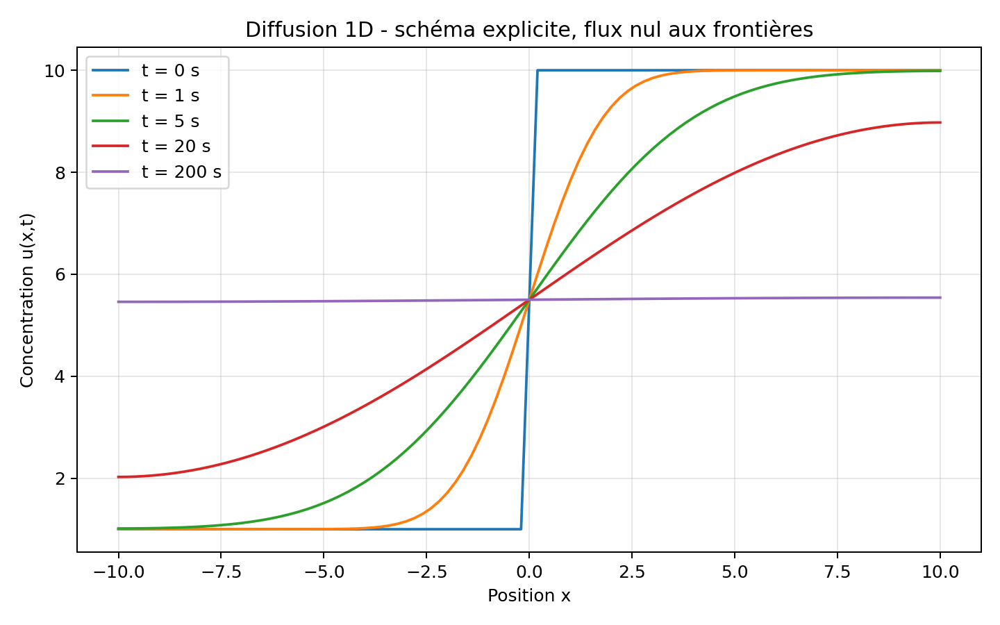
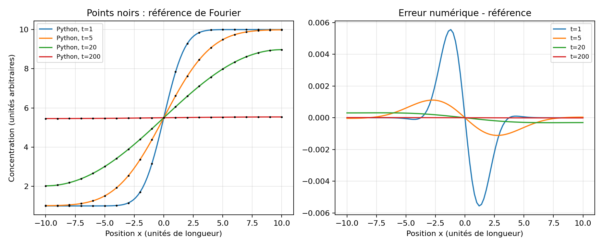

# Résolution numérique de l’équation de diffusion 1D

Ce projet reprend en Python un travail universitaire consacré à la résolution
de l’équation de diffusion par différences finies.

**Étape publiée : explicite / Neumann uniquement.** Reprise d'un projet de L3
réalisé sous MATLAB. Les autres schémas et conditions aux limites restent à réaliser.
Le cas est pédagogique : x, t et D utilisent des unités cohérentes arbitraires,
avec L=10 et D=1 ; aucune propriété d'un matériau réel n'est revendiquée.

## Étape 1 - Schéma explicite et conditions de Neumann homogènes

On considère :

$$
\frac{\partial u}{\partial t}
=D\frac{\partial^2u}{\partial x^2},
\qquad x\in[-L,L].
$$

La condition initiale est :

$$
u(x,0)=
\begin{cases}
1, & x<0,\\
10, & x\geq 0.
\end{cases}
$$

Les frontières sont imperméables :

$$
\frac{\partial u}{\partial x}(-L,t)=0,
\qquad
\frac{\partial u}{\partial x}(L,t)=0.
$$

Pour les nœuds intérieurs, le schéma explicite s’écrit :

$$
u_i^{n+1}
=M u_{i-1}^{n}+(1-2M)u_i^n+M u_{i+1}^{n},
\qquad
M=\frac{D\Delta t}{\Delta x^2}.
$$

Les conditions de Neumann sont appliquées avec des nœuds fictifs :

$$
u_{-1}^{n}=u_1^{n},
\qquad
u_{N+1}^{n}=u_{N-1}^{n}.
$$

La stabilité du schéma impose :

$$
M\leq\frac{1}{2}.
$$

Le nœud situé exactement en x=0 reçoit la demi-somme 5,5. La valeur en ce point
isolé ne modifie pas la solution continue pour t>0 ; cette convention préserve
la symétrie et la moyenne trapézoïdale discrète. La quantité conservée est
$\Delta x(u_0/2+\sum_{i=1}^{N-1}u_i+u_N/2)$, à l'arrondi près.

## Comparaison analytique

Pour t>0, la solution continue du créneau avec flux nul est :

$$
u(x,t)=5{,}5+\frac{18}{\pi}\sum_{k=0}^{\infty}
\frac{\sin((2k+1)\pi x/(2L))}{2k+1}
\exp\left[-D\left(\frac{(2k+1)\pi}{2L}\right)^2t\right].
$$

Chaque terme satisfait les conditions de Neumann ; ses coefficients proviennent
de la projection du créneau sur ces modes propres. La référence est tronquée
à 200 termes et utilisée à t≥1 pour ce cas (pas au saut initial).
Un test distinct utilise un unique mode sinusoïdal exact.




Ces vérifications ne remplacent pas une étude des ordres de convergence.
À t=200, le profil est proche de 5,5 mais pas exactement uniforme.

## Vérifications réalisées

- refus automatique d’un pas de temps instable ;
- conservation de l’intégrale de la concentration ;
- maintien exact d’un champ uniforme ;
- convergence vers un état spatialement uniforme ;
- valeur finale cohérente avec la moyenne intégrale initiale.

## Exécution

```bash
pip install -r requirements.txt
python exemple_neumann_explicite.py
python verifier_solution.py
python -m unittest discover -s tests -v
```

Les figures sont générées dans le dossier `resultats/`.
Exécuter les commandes depuis la racine du dépôt, avec Python 3.10 ou ultérieur.
Pour activer l'environnement créé par `python -m venv .venv`, utiliser
`.venv\Scripts\Activate.ps1` sous PowerShell ou `source .venv/bin/activate`
sous Linux/macOS avant l'installation.

## Organisation

```text
.
├── src/diffusion.py
├── tests/test_diffusion.py
├── exemple_neumann_explicite.py
├── requirements.txt
└── resultats/
```

## Suite prévue

1. étude systématique de convergence en espace et en temps ;
2. schéma implicite d’Euler rétrograde ;
3. conditions de Dirichlet ;
4. conditions mixtes ;
5. comparaison aux solutions stationnaires analytiques.

## English summary

This project implements a one-dimensional diffusion solver in Python using an
explicit finite-difference scheme. The first validated stage considers
homogeneous Neumann boundary conditions and checks stability, conservation and
convergence toward a uniform state.
